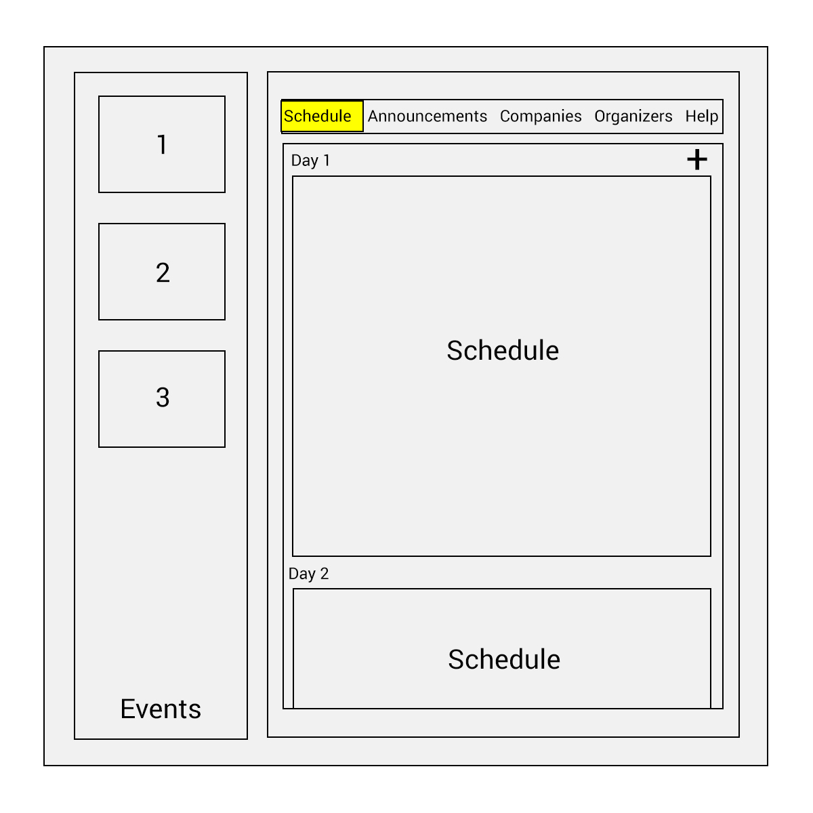
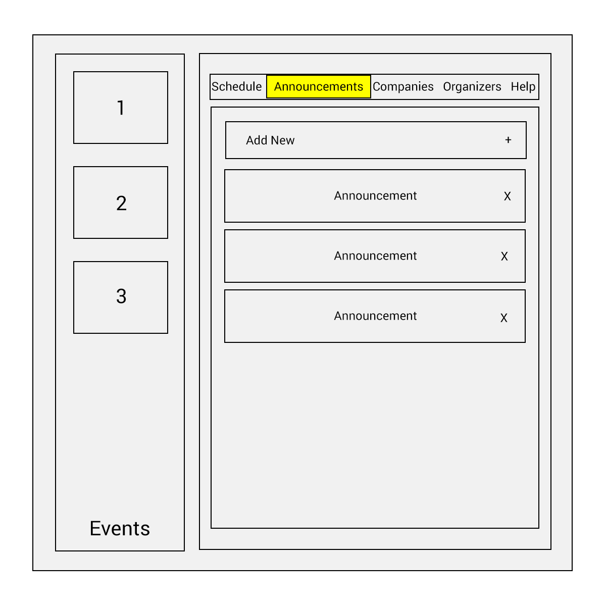
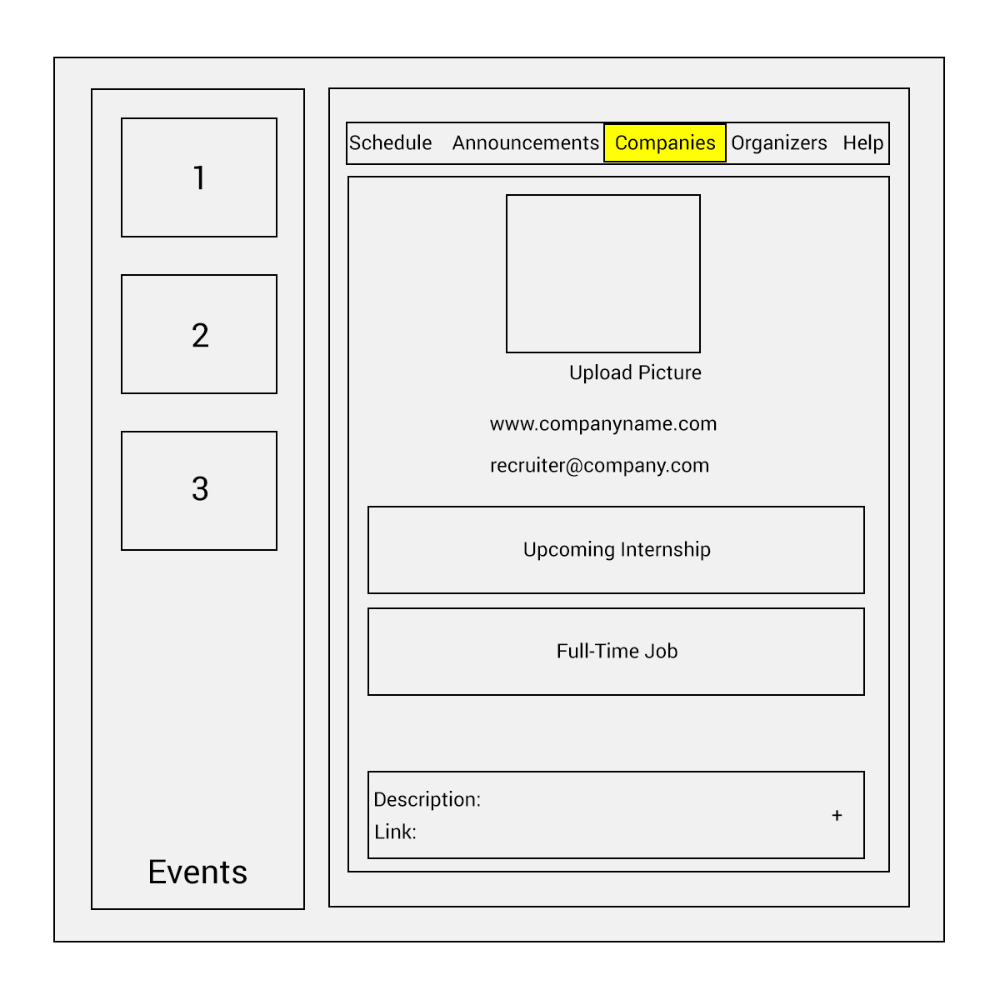
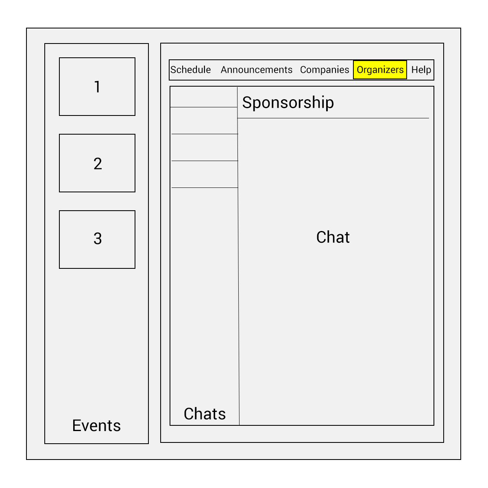
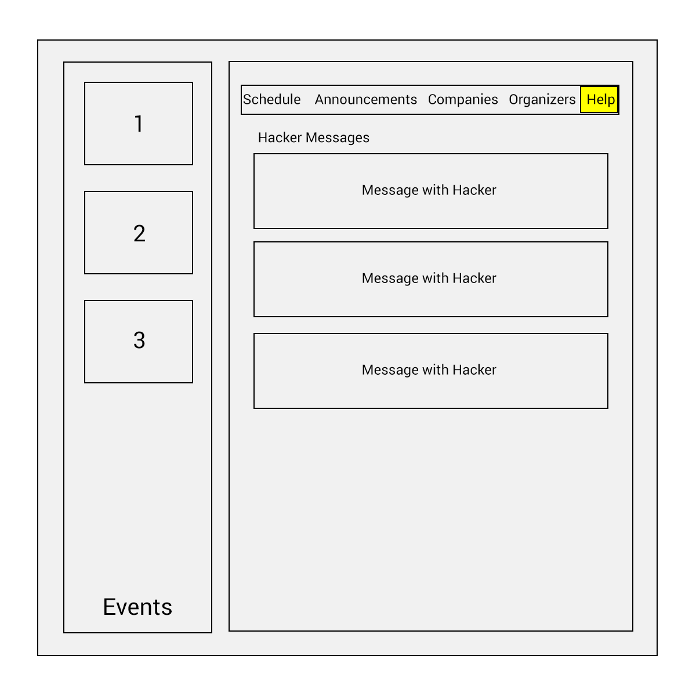
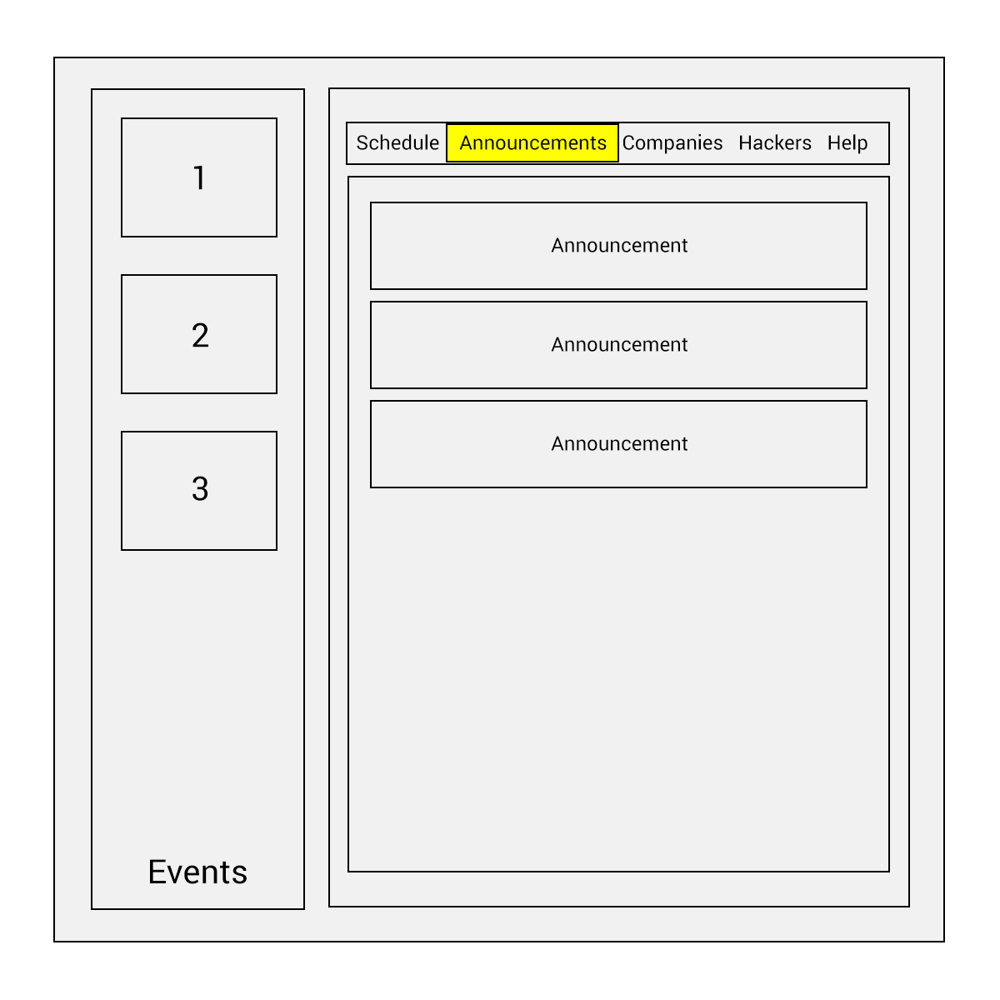
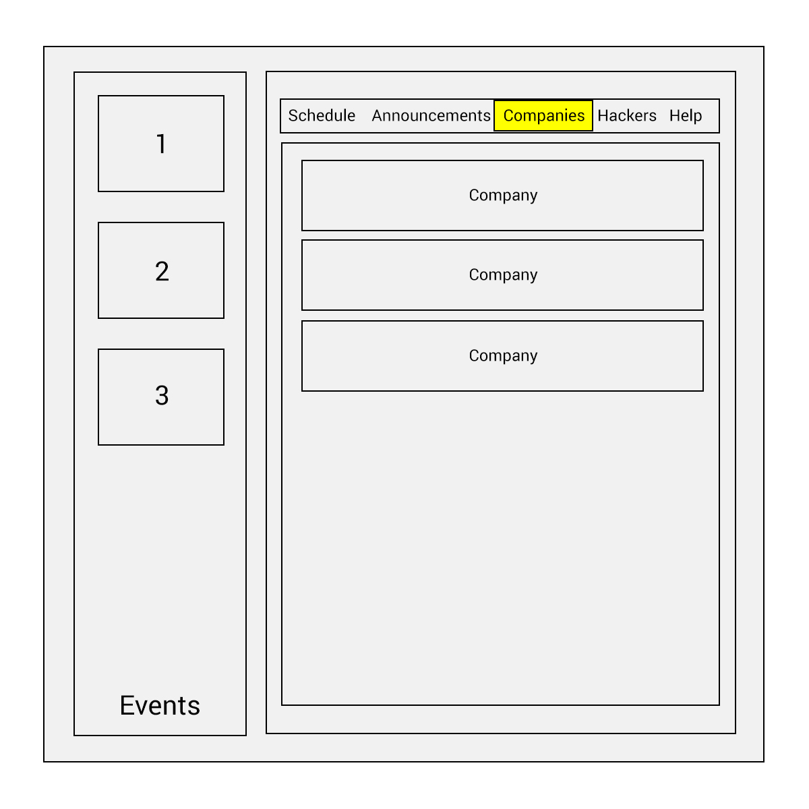
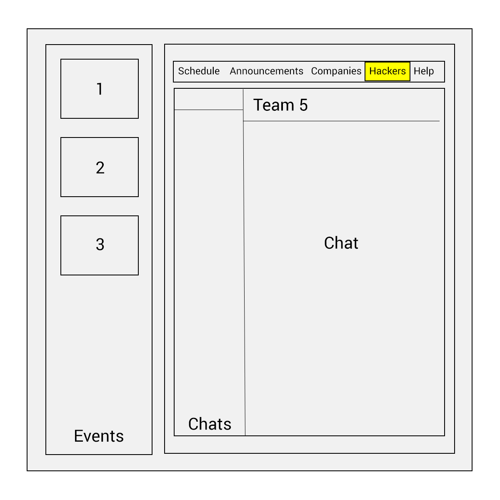
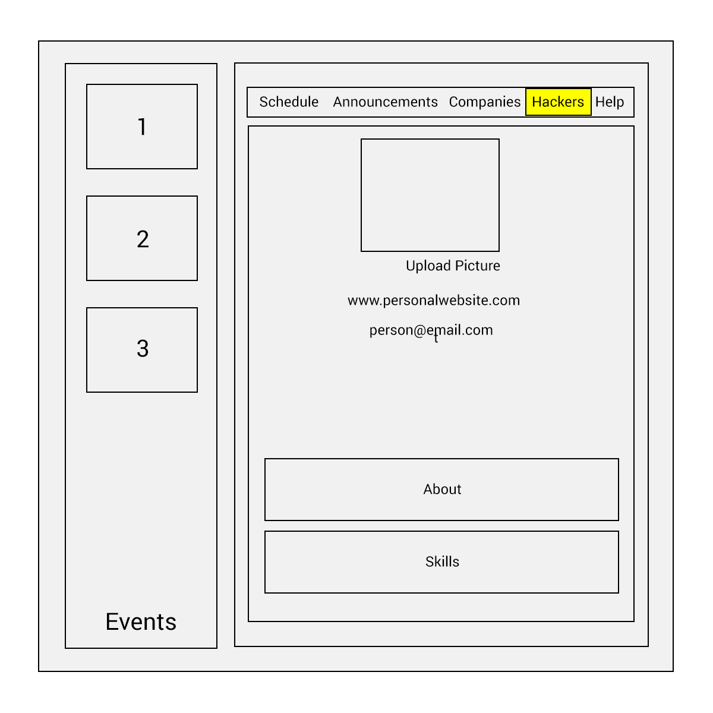
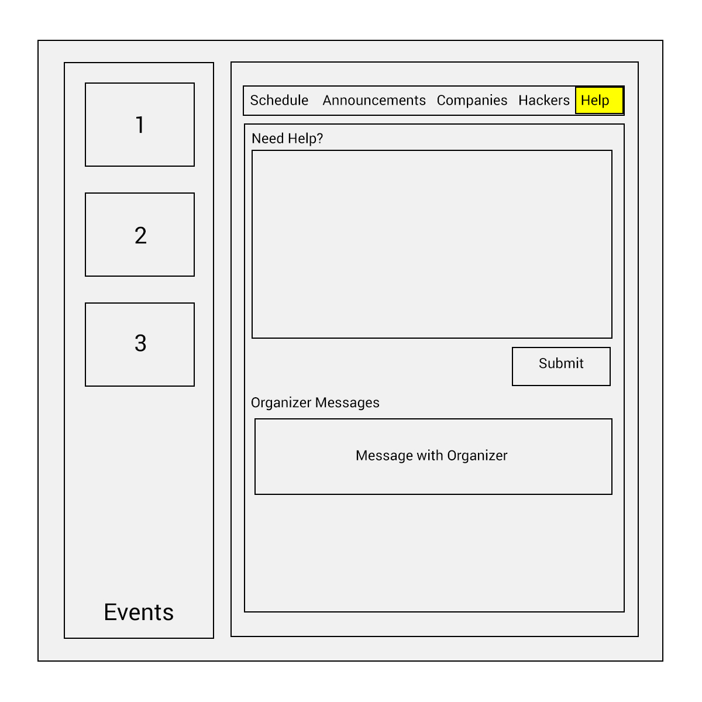

# HackHubFrontEnd
## A solution for the hectic Hackathon

HackHub is a platform for organizing communication at a hackathon event. Hackers, recruiters, and organizers can all find HackHub useful. Hackers can form teams and create messaging groups, keep track of the schedule at the Hackathon, and explore recruiters’ opportunities. Recruiters can promote their job opportunities and explore talent, and organizers can keep track of sponsors and run their event smoothly. HackHub’s dynamic nature in serving all of these users will streamline the hectic nature of a hackathon for all involved.

#### Summary

HackHub allows each user to sign up as an organizer, a recruiter, or a hacker. Each user will be added to user directory. User can view and update their personal profile at any time. Each role has different authorities.

###### Organizer
Organizer has the authority over everything. It can accomplish the followings:
- Create / Update an event, which will display on the calendar.
- Create / Delete an announcement.
- Create / Modify a company profile and job listing.
- Access to user directory.
- Review Help messages from hackers and contact them in person through email.

###### Recruiter
Recruiter  can accomplish the followings:
- View all announcements.
- View all company profiles.
- Create / Modify its own company profile and job listing.
- Access to user directory.
- Send Help messages to organizers.

###### Hacker
Hacker can accomplish the followings:
- View all announcements.
- View all company profiles.
- Access to user directory.
- Send Help messages to organizers.

#### Organizer Interface

#### Hacker Interface

#### Sitemap

## Architecture

### Front End

For our front end, we decided to use react+redux to organize our code. We broke down the list of different hackathon events into components, and also the various tabs for each user's specific event needs into components.

Actions and reducers are used to work with data from the server api for different components' uses; for example, currently we have the announcements section working and can post and receive announcements.

We have routing for the different pages organized in src/routes.js, and we use the axios library to give us a promise-based interface to make API requests. We also use the thunk library to allow our ActionCreators to return functions themselves instead of just actions with dispatch.

### Back End

For the back end, we decided to use an express and mongodb CRUD api server to connect to the front end. We use express routes and schema to implement the api for the front end components. To connect to mongo, we had to use a module called mongoose to treat data that we store in mongo as objects.

Currently, this is only implemented for our announcements posts.

## Setup

To set up the project development environment, you will need to fork or clone the two repositories needed for this project: HackHubFrontEnd and HackHubAPIServer. Within both, you will need to do the following locally:

In order to test the project, you will need to install the modules and libraries we have used here in the command line.

`npm install`

For local testing specifically, you will need to in HackHubFrontEnd run:

`npm start`

And in a different command line window, in HackHubAPIServer run (after setting up mongod):

`npm run dev`

Then follow the steps below in a third command line window to deploy and test the initial product.

## Deployment

Currently, the server is set up to deploy automatically on Heroku when the master branch of HackHubAPIServer is updated. Additionally, the frontend is deployed automatically on surge when the master branch of HackHubFrontEnd is updated. Since all deployment is automatic, to test the project after pushing to Github, visit the following link hackhub.surge.sh

On the other hand, if you would like to test locally, follow these steps:

To use mongod, create any directory to store data and then run

`mongod --dbpath <path to data directory>`

Then, while mongod is still running, go to the directory of HackHubAPIServer. There, run

`npm run dev`

This should set up the local server on localhost:9090. The current project is set up to use this server, so it should run correctly.

To test the project, run

`npm start`

and go to localhost:8080.

## Authors

Erin Connolly, Emma Oberstein, Sophia Jiang, Robert Sayegh, Jean Zhou

## Acknowledgments

Thanks to Tim for helping us through this project!
