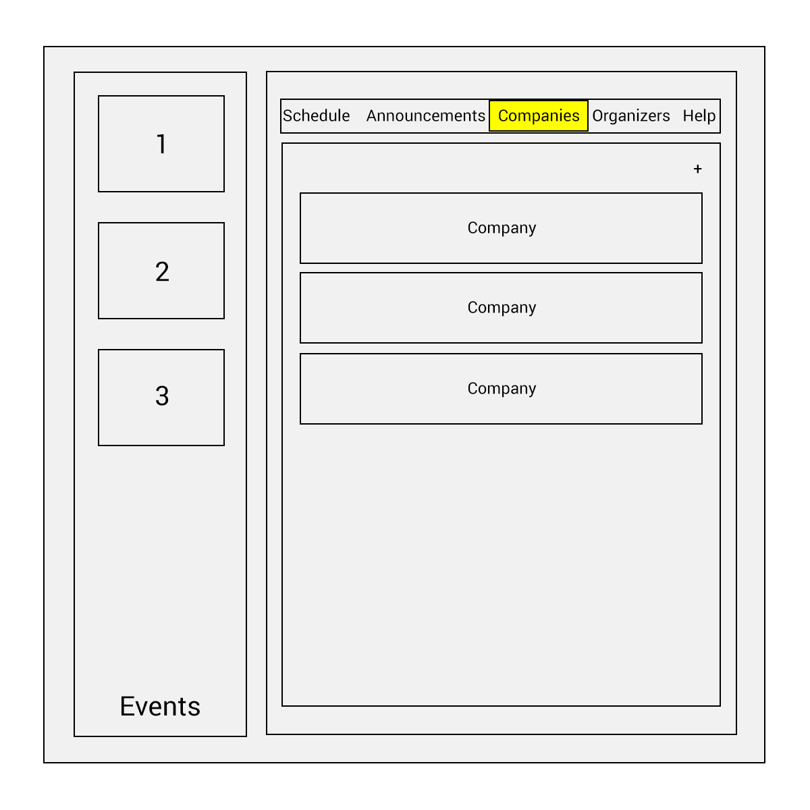

# HackHubFrontEnd
## A solution for the hectic Hackathon

HackHub is a platform for organizing communication at a hackathon event. Hackers, recruiters, and organizers can all find HackHub useful. Hackers can form teams and create messaging groups, keep track of the schedule at the Hackathon, and explore recruiters’ opportunities. Recruiters can promote their job opportunities and explore talent, and organizers can keep track of sponsors and run their event smoothly. HackHub’s dynamic nature in serving all of these users will streamline the hectic nature of a hackathon for all involved.

#### Organizer Interface

#### Hacker Interface

## Architecture

TODO:  descriptions of code organization and tools and libraries used

## Setup

TODO: how to get the project dev environment up and running, npm install etc

## Deployment

TODO: how to deploy the project

## Authors
Erin Connolly, Emma Oberstein, Sophia Jiang, Robert Sayegh, Jean Zhou

## Acknowledgments
