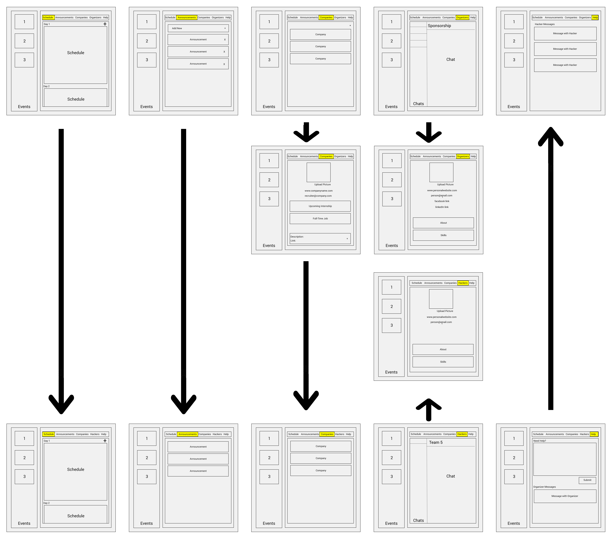

# HackHubFrontEnd
## A solution for the hectic Hackathon

HackHub is a platform for organizing communication at a hackathon event. Hackers, recruiters, and organizers can all find HackHub useful. Hackers can keep track of the hackathon schedule, receive announcements (notified by text), view profiles of other hackers, and explore recruiters’ opportunities. Recruiters can promote their job opportunities and explore talent, and organizers can keep track of sponsors and run their event smoothly with control over all features of HackHub. HackHub’s dynamic nature in serving all of these users will streamline the hectic nature of a hackathon for all involved.

### Summary

HackHub allows each user to sign up (with email, password, and profile picture) as an organizer, a recruiter, or a hacker. Each user will be added to user directory. User can view and update their personal profile at any time. Each role has different authorities.

#### Organizer
Organizers have authority over the entire site and can accomplish the following:
- Create/Update an event to display on the schedule.
- Create/Delete an announcement for a group (hackers, recruiters, or both). Once an announcement is made, a text message is sent to every user in the group, based on the phone number they provide on their profile.
- Create/Update any company profile.
- Manage the user directory/database (delete users).
- Update their own user profile.
- Review help messages from hackers/recruiters.

#### Recruiter
Recruiters can accomplish the following:
- View the hackathon schedule of events.
- View all announcements for recruiters.
- View all company profiles.
- Modify their own company profile and job listing.
- View all user profiles.
- Update their own user profile.
- Send help messages to organizers.

#### Hacker
Hackers can accomplish the followings:
- View the hackathon schedule of events.
- View all announcements for hackers.
- View all company profiles with job listings.
- View all user profiles.
- Update their own user profile.
- Send help messages to organizers.

#### Organizer Interface

#### Hacker Interface

#### Sitemap

## Architecture

### Front End

For our front end, we decided to use react+redux to organize our code. We broke down the list of different hackathon events into components, and also the various tabs for each user's specific event needs into components.

Actions and reducers are used to work with data from the server api for different components' uses; for example, currently we have the announcements section working and can post and receive announcements.

We have routing for the different pages organized in src/routes.js, and we use the axios library to give us a promise-based interface to make API requests. We also use the thunk library to allow our ActionCreators to return functions themselves instead of just actions with dispatch.

### Back End

For the back end, we decided to use an express and mongodb CRUD api server to connect to the front end. We use express routes and schema to implement the api for the front end components. To connect to mongo, we had to use a module called mongoose to treat data that we store in mongo as objects.

## Setup

To set up the project development environment, you will need to fork or clone the two repositories needed for this project: HackHubFrontEnd and HackHubAPIServer. 

Then, you will need to install the modules and libraries we have used here in the command line.

`npm install`

For completely local testing, you will need to change the server address. In HackHubFrontEnd, go to `src/actions/index.js`. There, change the line `const ROOT_URL = 'https://hackhub-server.herokuapp.com/api'` to `const ROOT_URL = 'localhost:9090/api'`. 

Then, in a different command line window, set up mongod for a local database. Then go to the directory for HackHubAPIServer and run (after setting up mongod):

`npm run dev`

Finally, you will need to go to the direcotry for HackHubFrontEnd and run:

`npm start`

This sets up the site to be viewed on `localhost:8080` while testing.

## Deployment

Using Travis, both the front end and back end are set up to deploy automatically once the master branch of the github repo is updated. The server will deploy automatically on Heroku, while the frontend will deploy automatically on surge. 

The link to the server is: `https://hackhub-server.herokuapp.com/api`. To see the site after deployment, visit the following link: `hackhub.surge.sh`

Note: Remember to set go to `src/actions/index.js` in HackHubFrontEnd and make sure the server is set correctly to `const ROOT_URL = 'https://hackhub-server.herokuapp.com/api'` before pushing to github for deployment. 

## Authors

Emma Oberstein, Erin Connolly, Jean Zhou, Robert Sayegh, Sophia Jiang

## Acknowledgments

We use the Twilio for sending announcements by text message and Cloudinary for storing profile images. 

Thanks to Tim for helping us through this project!
